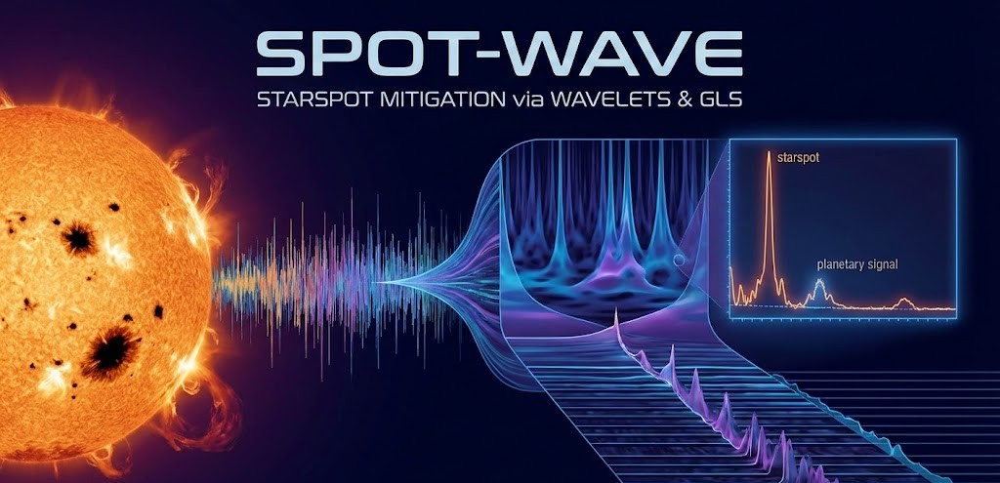

# Spot Wave

Library that systematizes time-frequency
analysis with [wavepal](https://github.com/guillaumelenoir/WAVEPAL) +
CARMCMC, wavelet filtering (single or double) of stellar activity in
radial velocities, and orbital fitting with
[CONAN](https://github.com/mlendl42/CONAN3) on the residuals.

## Structure

```text
spot_wave/
├── __init__.py      # public API of the package
├── __main__.py       # CLI: python -m spot_wave single|double ...
├── __version__.py
├── utils.py          # setup_carmcmc, load_rv_file, test_cwt_feasibility, wavepal_analyze
├── filter.py          # single_filter_sweep (1 band) and run_double_filter_sweep (2 bands, order 1/2)
├── conan_fit.py        # run_conan_fit, extract_conan_metrics, extract_k_posterior
└── scalogram.py        # analyze_and_plot, w0_loop
```

## Installation

This pipeline requires a virtual environment (`venv`). 

### 1. Create and Activate Virtual Environment
```bash
python3 -m venv spot_wave_v1
source spot_wave_v1/bin/activate
```

### 2. Install System Dependencies
CARMCMC requires BOOST and ARMADILLO system C++ libraries to compile.

**Ubuntu:**
```bash
sudo apt-get update
sudo apt-get install libboost-all-dev libboost-python-dev libarmadillo-dev
```
*(Note for Linux users: If the compiler cannot find the Boost Python library during step 4, create a symlink matching your Python version, e.g., `sudo ln -s /usr/lib/x86_64-linux-gnu/libboost_python3.so /usr/lib/x86_64-linux-gnu/libboost_python310.so`)*

**macOS (via Homebrew):**
```bash
brew install boost armadillo
```

### 3. Install SPOT-WAVE and CONAN
Installing `SPOT-WAVE` in editable mode automatically clones and installs the required CONAN fork.
```bash
git clone [https://github.com/Uriel-Merino/SPOT-WAVE](https://github.com/Uriel-Merino/SPOT-WAVE)
cd SPOT-WAVE
pip install -e .
cd ..
```

### 4. Compile and Install WAVEPAL + CARMCMC
The original `Linux_install.sh` and `MacOSX_install.sh` scripts are deprecated for modern Python 3. The `carmcmc` library must be compiled manually. 

Clone the repository and compile the C++ extension in place:
```bash
git clone [https://github.com/Uriel-Merino/WAVEPAL.git](https://github.com/Uriel-Merino/WAVEPAL.git)
cd WAVEPAL/carmcmc_pack/carma_pack/src
python setup.py build_ext --inplace
```

Navigate back to the WAVEPAL root, install the package bypassing dependency checks:
```bash
cd ../../../
pip install --no-deps .
cd ..
```

### 5. Configure Dynamic Paths (Portability)
To ensure the pipeline is portable and works seamlessly without hardcoding user paths, inject the CARMCMC path and the `gls.py` location directly into the virtual environment's activation script. 

Ensure your `gls.py` file is placed directly inside the main `spot_wave_v1` folder, then run:

```bash
echo 'export SPOT_WAVE_CARMCMC_PATH="$VIRTUAL_ENV/WAVEPAL/carmcmc_pack/carma_pack/src"' >> $VIRTUAL_ENV/bin/activate
echo 'export PYTHONPATH="$VIRTUAL_ENV:$PYTHONPATH"' >> $VIRTUAL_ENV/bin/activate
```

Reload the environment to apply the new paths:
```bash
deactivate
source spot_wave_v1/bin/activate
```

You can verify the installation by testing the initialization of the C++ libraries:
```bash
python -c "import spot_wave as sw; sw.setup_carmcmc(); import gls; print('\nSuccess! Pipeline is ready.')"
```

